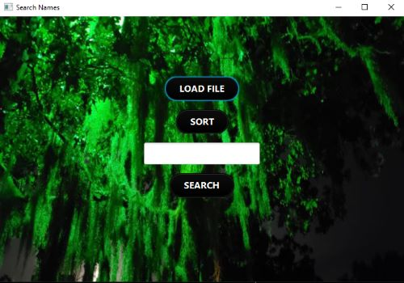
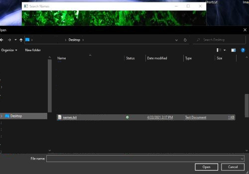
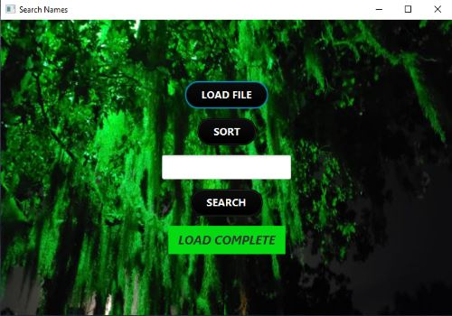
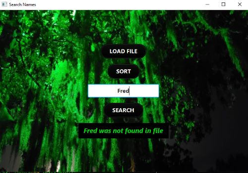
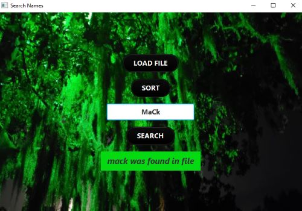
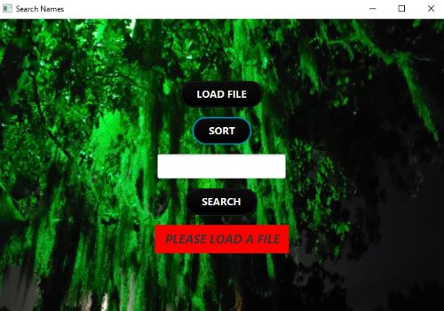
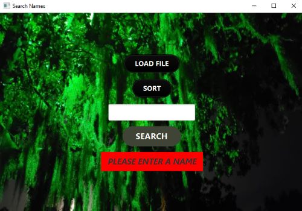

<h1 align="center">Welcome to Name Search</h1>

<!--  -->

<h4 align="center">
  Javafx:  Load file button will open file explorer.  Select a .txt file containing names.  Type a name in the textfield and click search to see if a name exists in the file you have choose.  This program uses the quick sort algorithm before using the binary searcher algorithm.
</h4>
 

<h2 align="center" style="text-decoration: underline;">Using this GUI is as follows:</h2>

<h4 align="center">
    1. Click on the LOAD FILE button to open file explorer.  

  <!--  -->
</h4>

<h4 align="center">
    2. Once a file has been selected, file explorer will close.  The dispaly will say LOAD COMPLETE.

  <!--  -->
</h4>

<h4 align="center">
    3. Click on the SORT button to quick sort the names from the file.  Once sorted, the display will read SORT COMPLETE.  

  <!--  -->
</h4>

<h4 align="center">
    4. Click in the textfield to type in a name.  Capitalization does not matter.  Click on the SEARCH button to see if the name you typed in exists in the file.  The display will say if the name was in the file or not.

  <!--  -->
</h4>

<h2 align="center" style="text-decoration: underline;">Errors:</h2>

<h4 align="center">
    1. If the SORT button is pressed before a file is loaded, the program will not sort the file.  Please load a file before sorting.

    <!--  -->
</h4>

<h4 align="center">
    2. If trying to search for a name, the file must be sorted first or an error message will be displayed.

    <!--  -->
</h4>

<h4 align="center">
    3. If the textfield is blank and the SEARCH button is clicked, a error message will be displayed.  Please type a name in and try again.

    <!--  -->
</h4>

<!-- For more details see [GitHub Flavored Markdown](https://guides.github.com/features/mastering-markdown/). -->
<!-- You can use the [editor on GitHub](https://github.com/zuki07/Load_file/edit/master/README.md) to maintain and preview the content for your website in Markdown files. -->
